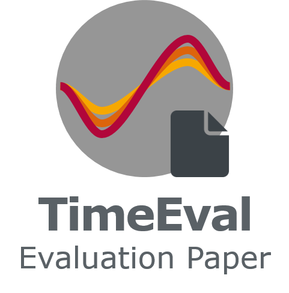

<h1 align="center">Anomaly Detection in Time Series: A Comprehensive Evaluation</h1>

  Go to the <a href="https://hpi-information-systems.github.io/timeeval-evaluation-paper/" alt="website">website</a> for further information.

Time series anomaly detection experimental evaluation paper supporting material and website.

## Related repositories

- Time series anomaly generator [GutenTAG](https://github.com/HPI-Information-Systems/gutentag)
- Evaluation tool [TimeEval](https://github.com/HPI-Information-Systems/TimeEval)
- Algorithm source code (and necessary docker images): [TimeEval-algorithms](https://github.com/HPI-Information-Systems/TimeEval-algorithms)

For the datasets, go to the [datasets page](https://hpi-information-systems.github.io/timeeval-evaluation-paper/notebooks/Datasets.html).
