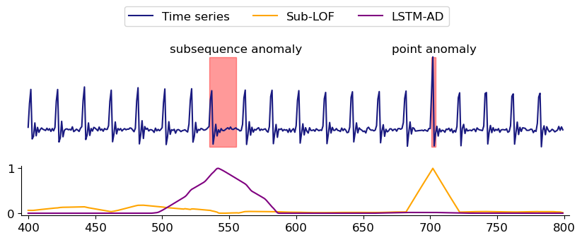

# Anomaly Detection in Time Series: A Comprehensive Evaluation

This is the supporting website for the paper ["Anomaly Detection in Time Series: A Comprehensive Evaluation"](http://vldb.org/pvldb/vol15/p1779-wenig.pdf).
On this website, we provide the implementations of all algorithms, links to the used datasets, additional algorithm and dataset metadata, as well as further insights from our results that did not make it into the paper.

If you use our artifacts, please consider [citing our paper](#reference).

## Reference

If you use our evaluation results or our benchmark datasets and algorithms, please cite our evaluation paper:

> Sebastian Schmidl, Phillip Wenig, and Thorsten Papenbrock.
> Anomaly Detection in Time Series: A Comprehensive Evaluation. PVLDB, 15(9): 1779 - 1797, 2022.
> doi:[10.14778/3538598.3538602](https://doi.org/10.14778/3538598.3538602)

If you use the TimeEval toolkit or any of its related software artifacts in your project or research, please cite our demonstration paper:

> Phillip Wenig, Sebastian Schmidl, and Thorsten Papenbrock.
> TimeEval: A Benchmarking Toolkit for Time Series Anomaly Detection Algorithms. PVLDB, 15(12): 3678 - 3681, 2022.
> doi:[10.14778/3554821.3554873](https://doi.org/10.14778/3554821.3554873)

You can use the following BibTeX entries:

```bibtex
@article{SchmidlEtAl2022Anomaly,
  title = {Anomaly Detection in Time Series: A Comprehensive Evaluation},
  author = {Schmidl, Sebastian and Wenig, Phillip and Papenbrock, Thorsten},
  date = {2022},
  journaltitle = {Proceedings of the VLDB Endowment (PVLDB)},
  volume = {15},
  number = {9},
  pages = {1779--1797},
  doi = {10.14778/3538598.3538602}
}
@article{WenigEtAl2022TimeEval,
  title = {TimeEval: A Benchmarking Toolkit for Time Series Anomaly Detection Algorithms},
  author = {Wenig, Phillip and Schmidl, Sebastian and Papenbrock, Thorsten},
  date = {2022},
  journaltitle = {Proceedings of the VLDB Endowment (PVLDB)},
  volume = {15},
  number = {12},
  pages = {3678--3681},
  doi = {10.14778/3554821.3554873}
}
```

## Motivation

Detecting anomalous subsequences in time series data is an important task in areas ranging from manufacturing processes over finance applications to health care monitoring.
An anomaly can indicate important events, such as production faults, delivery bottlenecks, system defects, or heart flicker, and is therefore of central interest.
The different anomaly types, pattern models, and time series properties led to the development of a multitude of different anomaly detection algorithms, about which various surveys exist [^Blazquez-GarciaEtAl2020review] [^BraeiWagner2020Anomaly] [^ChalapathyChawla2019Deep] [^ChandolaEtAl2012Anomaly] [^ChandolaEtAl2009Anomaly] [^ChoudharyEtAl2017RuntimeEfficacy] [^CookEtAl2020Anomaly] [^GuptaEtAl2014Outlier] [^HodgeAustin2004Survey].
In total, we collected 158 publications about anomaly detection algorithms for time series datasets.
Many of them follow very similar detection approaches, but the general variety of approaches is remarkably high, ranging from simple outlier detection over statistical analysis, signal processing, and data mining to deep learning approaches.
Because all of these approaches exhibit individual strengths and weaknesses, selecting a suitable algorithm for a given anomaly detection task is extremely difficult.



The previous Figure, for example, shows that the distance method Sub-LOF detects the point anomaly very well, because it is sensitive to value magnitudes and change amplitudes;
it however fails to detect the subsequence anomaly, because it is insensitive to point orders.
LSTM-AD as a forecasting method, on the contrary, learns normal patterns and heavily relies on seasonality/periodicity;
for this reason, it easily identifies the anomalous subsequence, but since it is robust to noise, it ignores the point anomaly.

Because there is no comprehensive scientific study that evaluates time series anomaly detection algorithms, it is completely unclear how well they perform w. r. t. varying datasets, anomaly types, and parameter settings.
Considering the existing evaluations of individual algorithms, we find that they usually consider only a tiny fraction of related work algorithms and that they are often based on trivial, cherry-picked, biased, mislabeled, unrealistic, or only few datasets.
For this reason, Wu and Keogh even claimed that all "current time series anomaly detection benchmarks are flawed" [^WuKeogh2020Current].
To create a meaningful evaluation, we collected and re-implemented a significant amount of 71 anomaly detection algorithms that represent a broad spectrum of anomaly detection families.
For their evaluation, we put together 967 time series datasets from different domains and generated a bunch of datasets with artificial, but particularly interesting anomalies.
The variety of algorithms and datasets used in this experimental study should provide a clear and reliable picture of the state-of-the-art in time series anomaly detection.

### Overview

In [the paper][paper], we provide practical insights that should help experts to select the optimal algorithm for their anomaly detection task.
Our study also shows the current state-of-the-art in time series anomaly detection and, therefore, serves as an entry point for researchers into the topic.
We indicate potential for future research and, in this way, support the development of new algorithms that are now able to address specific issues, exploit certain capabilities, and ultimately advance the field of anomaly detection.

On this website, we provide the download-links for the datasets and algorithms used in the study.
In addition, we give some further metadata about and insights into data, algorithms, and results:

- [Datasets Overview and Metadata](./notebooks/Datasets.html)
- [Algorithms Overview and Metadata](./notebooks/Algorithms.html)
- Detailed experimental evaluation results ... (tbd)
  - [on our synthetically generated datasets (GutenTAG)](./notebooks/GutenTAG-result-analysis.html)
  - [on all the collected "real-world" datasets](./notebooks/Benchmark-result-analysis.html)
  <!--- (extra) on multivariate, synthetically generated datasets with correlation anomalies -->
- [Case studies](./notebooks/Case-studies.html):
  - [Datasets with no anomalies](./notebooks/Case-studies.html#no-anomalies)
  - [Datasets with a high contamination](./notebooks/Case-studies.html#high-contamination)
  - [Parameter sensitivity](./notebooks/Case-studies.html#parameter-sensitivity)
  - [Detecting anomalies of variable lengths](./notebooks/Detecting-Anomalies-of-Variable-Lengths.html)
  <!--- Large datasets (tbd) -->

### Evaluation Metrics

We use threshold-agnostic evaluation metrics that calculate a single value by comparing the anomaly scorings to the labels. The metrics calculate the area under a curve, which is realized with the Python Package _scikit-learn_ [^sklearn].
The different metrics have different reward and penalize foci.

#### AUC-ROC

The _Area under the Receiver Operator Characteristic Curve_ [^HanleyMcNeil1982AUCROC] [^Bradley1997AUCROC] (AUC-ROC) contrasts the _True Positives Rate_ (TPR) with the _False Positives Rate_ (FPR or Recall). Its focus is on an algorithm's sensitivity.

#### AUC-PR

The _Area under the Precision Recall Curve_ [^Raghavan1989AUCPR] [^Davis2006AUCPR] (AUC-PR) contrasts the _Precision_ with the _Recall_. Its focus is on an algorithm's preciseness.

#### AUC-P<sub>T</sub>R<sub>T</sub>

The _Area under the Range Based Precision Recall Curve_ [^Tatbul2018Range] (AUC-P<sub>T</sub>R<sub>T</sub>) softens the very strict preciseness requirements of AUC-PR to adapt the measure to subsequences. We use the Python Package _prts_ [^prts] to calculate the range-based Precision and Recall values and, further, use them to get the area under its curve. We used the following (default) values for the range-based metrics:

| Parameter | Value |
| --------- | ----- |
|   alpha   |  0.0  |
| cardinality | one |
|    bias   | flat  |

<!--
#### AVERAGE-PRECISION

-->

## Key Insights

The following section presents the key insights that we discovered throughout this study.

### General Findings

1. There is no one-size-fits-all solution in the set of currently available algorithms: A multivariate algorithm is necessary to detect multivariate anomalies (e.g., anomalies in the correlation of series), but a univariate algorithm is preferable for univariate data.
2. Despite that supervised algorithms use additional information during training (labels for normal *and* anomalous points), they do not achieve superior results compared to semi-supervised or even unsupervised approaches.
3. The most relevant scoring metric, such as AUC-ROC or AUC-PR, depends on the use case and what the results are expected to indicate.
4. Every anomaly detection family can be effective and there is no clear winner. Furthermore, no single algorithm achieves perfect scores leaving much room for future work.
5. Due to the lack of structure in chaotic time series, most algorithms struggle to find a suitable representation for normal behavior or cannot distinguish between normal and abnormal subsequences at all. This class of time series is very challenging for anomaly detection algorithms and requires future work.
6. Anomalies on periodic time series are easier to detect than on non-periodic time series.
7. Anomaly detection on univariate time series is on average easier than on multivariate time series.
8. An *extremum* seems to be the easiest anomaly type and a *trend* the hardest anomaly type. Please refer to the documentation of [GutenTAG](https://github.com/HPI-Information-Systems/gutentag) for a definition of these anomaly types.

### Specific Findings

1. The relatively high overall error susceptibility – despite our strong investment into each implementation – shows that every practical algorithm deployment needs careful testing; only few implementations, such as *DWT-MLEAD*, *KNN*, and *Subsequence LOF*, actually appear to be both robust and effective.
2. *Frequency* and *pattern-shift* anomalies clearly separate the algorithms in ones that can (mostly distance and forecasting families) and ones that cannot (mostly reconstruction and tree families) detect them.
3. In summary, most reconstruction methods yielded rather bad AUC-ROC scores (around 0.5) and only some algorithms in this group, i.e., *EncDec-AD* and *Donut*, can detect anomalies well across all characteristics. Forecasting and distance algorithms, on the contrary, yielded particularly good results and many of their representatives, such as *DeepAnT* and *Subsequence LOF*, are amongst the best performing algorithms in almost every characteristic. Finally, distance algorithms performed remarkably well on variance anomalies.
4. Most supervised and semi-supervised algorithms are amongst the slowest algorithms in our evaluation and need on average 255 ms for one data point, which is largely due to their long training times. This observation confirms similar conclusions made in related work[^JacobEtAl2021Exathlon].
5. Overall, neither the fastest algorithms nor the slowest algorithms delivered qualitatively good results. The algorithm with the clearly best cost/benefit ratio in our experiments is *DWT-MLEAD* with an average AUC-ROC score of 0.83 and an outstanding runtime of 2.2 ms per data point.
6. Most implementations do not struggle with our 3 GB memory limit.


## Related Resources

- Dataset download-links can be found on the [datasets-page](./notebooks/Datasets.html)
- Source code repositories:
  - Evaluation tool TimeEval: [Github](https://github.com/HPI-Information-Systems/TimeEval)
  - Time series anomaly generator GutenTAG: [Github](https://github.com/HPI-Information-Systems/gutentag)
  - Algorithm source code (and necessary docker images): [Github](https://github.com/HPI-Information-Systems/TimeEval-algorithms)
- [HPI umbrella project](https://hpi.de/naumann/projects/distributed-computing/efficient-subsequence-anomaly-detection-on-time-series-data.html)

## References

[^WuKeogh2020Current]: Wu, Renjie, and Eamonn J. Keogh. "Current Time Series Anomaly Detection Benchmarks Are Flawed and Are Creating the Illusion of Progress." ArXiv:2009.13807 [Cs, Stat], 2020. http://arxiv.org/abs/2009.13807.
[^Blazquez-GarciaEtAl2020review]: Blázquez-García, Ane, Angel Conde, Usue Mori, and Jose A. Lozano. "A Review on Outlier/Anomaly Detection in Time Series Data." ArXiv:2002.04236 [Cs, Stat], 2020. http://arxiv.org/abs/2002.04236.
[^BraeiWagner2020Anomaly]: Braei, Mohammad, and Sebastian Wagner. "Anomaly Detection in Univariate Time-Series: A Survey on the State-of-the-Art." ArXiv:2004.00433 [Cs, Stat], 2020. http://arxiv.org/abs/2004.00433.
[^ChalapathyChawla2019Deep]: Chalapathy, Raghavendra, and Sanjay Chawla. "Deep Learning for Anomaly Detection: A Survey." ArXiv:1901.03407 [Cs, Stat], 2019. http://arxiv.org/abs/1901.03407.
[^ChandolaEtAl2012Anomaly]: Chandola, V., A. Banerjee, and V. Kumar. "Anomaly Detection for Discrete Sequences: A Survey." IEEE Transactions on Knowledge and Data Engineering (TKDE) 24, no. 5 (2012): 823–39. https://doi.org/10.1109/TKDE.2010.235.
[^ChandolaEtAl2009Anomaly]: Chandola, Varun, Arindam Banerjee, and Vipin Kumar. "Anomaly Detection: A Survey." ACM Computing Surveys 41, no. 3 (2009): 1–58. https://doi.org/10.1145/1541880.1541882.
[^ChoudharyEtAl2017RuntimeEfficacy]: Choudhary, Dhruv, Arun Kejariwal, and Francois Orsini. "On the Runtime-Efficacy Trade-off of Anomaly Detection Techniques for Real-Time Streaming Data." ArXiv:1710.04735 [Cs, Eess, Stat], 2017. http://arxiv.org/abs/1710.04735.
[^CookEtAl2020Anomaly]: Cook, Andrew A., Goksel Misirli, and Zhong Fan. "Anomaly Detection for IoT Time-Series Data: A Survey." IEEE Internet of Things Journal 7, no. 7 (2020): 6481–94. https://doi.org/10.1109/JIOT.2019.2958185.
[^GuptaEtAl2014Outlier]: Gupta, Manish, Jing Gao, Charu C. Aggarwal, and Jiawei Han. "Outlier Detection for Temporal Data: A Survey." IEEE Transactions on Knowledge and Data Engineering (TKDE) 26, no. 9 (2014): 2250–67. https://doi.org/10.1109/TKDE.2013.184.
[^HodgeAustin2004Survey]: Hodge, Victoria J., and Jim Austin. "A Survey of Outlier Detection Methodologies." Artificial Intelligence Review 22, no. 2 (2004): 85–126. https://doi.org/10.1007/s10462-004-4304-y.
[^sklearn]: Pedregosa, F., G. Varoquaux, A. Gramfort, V. Michel, B. Thirion, O. Grisel, M. Blondel, et al. “Scikit-Learn: Machine Learning in Python.” Journal of Machine Learning Research 12 (2011): 2825–2830.
[^HanleyMcNeil1982AUCROC]: James A. Hanley, and Barbara J McNeil. “The Meaning and Use of the Area under a Receiver Operating Characteristic (ROC) Curve.” Radiology 143, no. 1 (1982): 29–36.
[^Bradley1997AUCROC]: Andrew P. Bradley. “The Use of the Area under the ROC Curve in the Evaluation of Machine Learning Algorithms.” Pattern Recognition 30, no. 7 (1997): 1145–1159.
[^Raghavan1989AUCPR]: Vijay Raghavan, Peter Bollmann, and Gwang S Jung. “A Critical Investigation of Recall and Precision as Measures of Retrieval System Performance.” ACM Transactions on Information Systems (TOIS) 7, no. 3 (1989): 205–229.
[^Davis2006AUCPR]: Davis, Jesse, and Mark Goadrich. “The Relationship between Precision-Recall and ROC Curves.” In Proceedings of the 23rd International Conference on Machine Learning, 233–240, 2006.
[^prts]: https://pypi.org/project/prts/
[^Tatbul2018Range]: Nesime Tatbul, Tae Jun Lee, Stan Zdonik, Mejbah Alam, and Justin Gottschlich. “Precision and Recall for Time Series.” ArXiv Preprint ArXiv:1803.03639, 2018.
[^JacobEtAl2021Exathlon]: Vincent Jacob, Fei Song, Arnaud Stiegler, Bijan Rad, YanleiDiao, and Nesime Tatbul. 2021. Exathlon: A Benchmark forExplainable Anomaly Detection over Time Series.Proceed-ings of the VLDB Endowment (PVLDB), 14, 2613–2626.


[paper]: # "paper download link pending"
