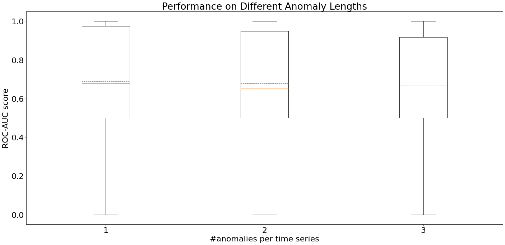

# Detecting Anomalies of Variable Lengths

Many time series anomaly detectors require the user to specify hyper-parameters that depend on the size of expected anomalies. However, a time series can contain multiple anomalies of different lengths. In our evaluation paper, we set these hyper-parameters to the maximum anomaly length of a time series.

In this case-study, we briefly want to contrast the overall results of our evaluation to results from time series that contain multiple anomalies of different lengths.

## New Time Series

The GutenTAG time series collection from our evaluation paper does not include anomalies of different lengths within a single time series. For each valid combination of base oscillation and anomaly type, we generated two additional time series. One time series with 2 anomalies of lengths *50* and *100* and one time series with 3 anomalies of lengths *50*, *100*, and *150*.

## Evaluation

For this evaluation, we compare the newly generated time series with the similar time series from the GutenTAG collection that only contain a single anomaly. For each setting (i.a. single anomaly, two different length anomalies, and tree different length anomalies), we evaluated 31 time series on all algorithms from the evaluation paper.

    

    

The above plot shows that the median (orange line) ROC-AUC score slightly decreases with an increasing number of unequally sized anomalies per time series. The mean (green dashed line) ROC-AUC score almost stays the same. In total, the difference in ROC-AUC scores is only very small. Our result averaging strategy even allows algorithms that work with fixed-length windows to mark variable length anomalies. Therefore, we conclude that the algorithms can reliably detect anomalies of variable lengths and that setting the aforementioned hyper-parameters to the maximum anomaly length is a reasonable decision.
